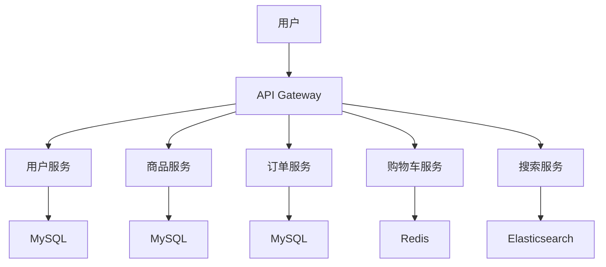

# 系统架构设计文档

## 1. 系统概述

乐优商城是一个基于 Spring Cloud 的分布式电商系统，包含多个微服务模块。

## 2. 架构图

## 3. 技术栈

- 后端：Spring Boot + Spring Cloud
- 数据库：MySQL + Redis
- 搜索：Elasticsearch
- 消息队列：RabbitMQ
- 配置中心：Spring Cloud Config
- 服务注册中心：Eureka
