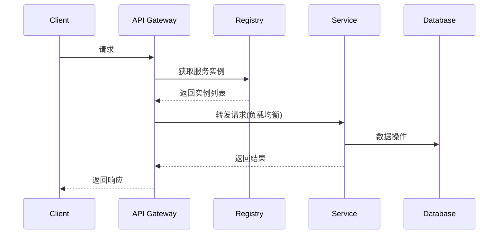

# 分布式系统核心原理

## 1. 基本概念
分布式系统是由多台计算机通过网络连接，协同完成任务的系统。核心特征包括：
- 并发性
- 缺乏全局时钟
- 组件故障独立性

## 2. 本项目分布式架构
当前系统采用微服务架构，主要包含以下分布式组件：
- 服务注册中心 (ly-registry)
- API网关 (ly-api-gateway)
- 配置中心 (ly-config)
- 多个业务微服务

## 3. 核心原理

### 3.1 CAP理论
- **一致性(Consistency)**: 所有节点同时看到相同数据
- **可用性(Availability)**: 每个请求都能获得响应
- **分区容错性(Partition tolerance)**: 系统在节点间通信失败时仍能工作

本项目采用AP架构，优先保证可用性和分区容错性。

### 3.2 服务发现与负载均衡
- 服务注册：各微服务启动时向注册中心注册
- 服务发现：通过注册中心获取可用服务实例
- 负载均衡：Ribbon客户端负载均衡

### 3.3 分布式事务
采用最终一致性方案：
1. 本地消息表
2. 可靠消息队列
3. TCC补偿事务

### 3.4 分布式锁
使用Redis实现分布式锁，解决并发问题：
```java
// 示例代码
SET resource_name my_random_value NX PX 30000
```

## 4. 关键组件交互


## 5. 性能优化
- 服务熔断：Hystrix实现
- 缓存策略：多级缓存(REDIS+本地缓存)
- 异步处理：消息队列解耦
